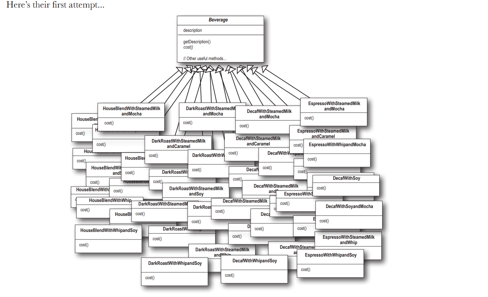

# Coffee Shop Example Using the Decorator Pattern

## Problem We're Trying to Solve

In this example, we are designing a system for a coffee shop where customers can order various types of beverages (like Espresso, House Blend, etc.) and customize them with different condiments (like Mocha, Whip, Soy, etc.). Each beverage has a base cost, and each condiment adds an extra cost.

The challenge is to represent these customizable beverages in a way that is flexible, maintainable, and avoids a classes explosion.

### Initial Approach - The Inheritance Problem

A naive approach might involve creating a class for every possible combination of beverage and condiment (e.g., `MochaEspresso`, `WhipMochaEspresso`, etc.). However, this quickly becomes impractical as the number of combinations grows exponentially with each new condiment or beverage type.

## How We Solve It

The **Decorator Pattern** offers a solution by allowing us to dynamically compose behavior by "decorating" objects. Instead of creating a class for every possible combination of beverage and condiment, we create a base `Beverage` class and decorate it with `CondimentDecorator` classes.

- **Beverages** (like `Espresso` and `HouseBlend`) are represented by concrete component classes that extend the `Beverage` base class.
- **Condiments** (like `Mocha` and `Whip`) are represented by concrete decorators that extend the `CondimentDecorator` class, which itself extends `Beverage`.
- Each decorator class wraps a `Beverage` object, adding its specific behavior (like an additional cost and an updated description).

Using this pattern, we can create complex beverages by combining various decorators without the need for an explosion of classes.

## Key Ideas for This Chapter

1. **Dynamic Composition of Behavior:**
   - The decorator pattern allows you to add behavior to an object dynamically by wrapping it with one or more decorators. This is in contrast to static inheritance, which determines behavior at compile time.

2. **Open for Extension, Closed for Modification:**
   - The decorator pattern adheres to the Open/Closed Principle, one of the SOLID principles. You can extend the functionality of objects by creating new decorators without modifying existing code.

3. **Avoiding Class Explosion:**
   - By using decorators, you avoid creating a large number of subclasses to represent every possible combination of a base object and its features. Instead, you create simple objects and compose them at runtime.

4. **Decoupling Responsibilities:**
   - The pattern decouples the core functionality of an object (e.g., being a `Beverage`) from its optional features or responsibilities (e.g., having `Mocha` or `Whip`), making the code more modular and easier to maintain.

5. **Transparency and Flexibility:**
   - Decorators are generally transparent to the object they are decorating; they adhere to the same interface as the object they wrap. This makes them interchangeable and flexible to use.

6. **Potential Drawbacks:**
   - While the decorator pattern offers great flexibility, it can also lead to a situation where you have many small objects that may be harder to manage. Additionally, debugging can be more challenging due to the added layers of wrapping.
