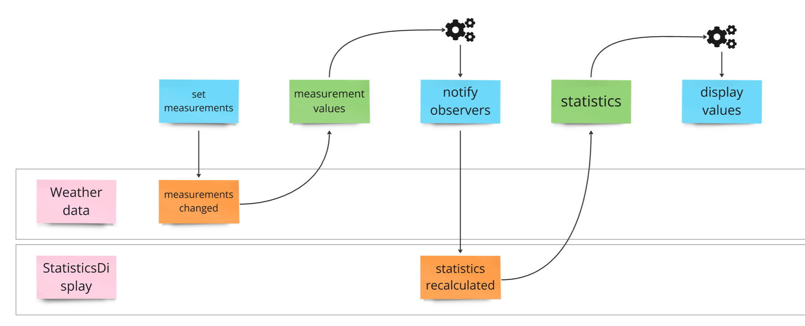

### Observer Pattern Summary

**Definition**: The Observer Pattern defines a one-to-many dependency between objects so that when one object changes state, all its dependents are notified and updated automatically.

#### Key Concepts:

1. **Subject and Observers**:
   - **Subject**: Maintains a list of its dependents (observers) and notifies them of any state changes.
   - **Observers**: Objects that watch the subject and get notified when the subject’s state changes.

2. **Decoupling**:
   - Decouples the subject from the observers, promoting a flexible and reusable design. The subject does not need to know the specifics about the observers, only that they implement a common interface.

3. **Interfaces**:
   - The subject provides methods to attach, detach, and notify observers.
   - Observers implement an interface that includes the `update` method, which gets called when the subject’s state changes.

4. **Concrete Implementation**:
   - **Concrete Subject**: Implements the subject interface and holds the actual state of interest to the observers.
   - **Concrete Observer**: Implements the observer interface and updates its state to match that of the subject when notified.

#### Benefits:
- **Loose Coupling**: Subjects and observers are loosely coupled, enhancing flexibility and reusability.
- **Flexibility**: Observers can be added or removed dynamically at runtime.
- **Reusability**: Both the subject and the observer can be reused independently.

#### Drawbacks:
- **Complexity**: Can introduce complexity in the code, especially with many observers.
- **Potential Performance Issues**: Updating a large number of observers can be time-consuming and affect performance.

### Conclusion:
The Observer Pattern is a powerful design pattern used to create a one-to-many relationship between objects, making it easier to maintain and extend applications by decoupling subjects from their observers. This pattern is particularly useful in scenarios where changes in one object need to be reflected in multiple other objects.

### Event model diagram



### Other examples:

#### MVVM
```c#
using System.ComponentModel;

public class PersonViewModel : INotifyPropertyChanged
{
    private string name;
    public string Name
    {
        get => name;
        set
        {
            if (name != value)
            {
                name = value;
                OnPropertyChanged(nameof(Name));
            }
        }
    }

    public event PropertyChangedEventHandler PropertyChanged;

    protected virtual void OnPropertyChanged(string propertyName)
    {
        PropertyChanged?.Invoke(this, new PropertyChangedEventArgs(propertyName));
    }
}
```

```xml
<Window x:Class="MVVMExample.MainWindow"
        xmlns="http://schemas.microsoft.com/winfx/2006/xaml/presentation"
        xmlns:x="http://schemas.microsoft.com/winfx/2006/xaml"
        Title="MVVM Example" Height="200" Width="400">
    <Grid>
        <StackPanel>
            <TextBox Text="{Binding Name, UpdateSourceTrigger=PropertyChanged}" Width="200" Margin="10"/>
            <TextBlock Text="{Binding Name}" Width="200" Margin="10"/>
        </StackPanel>
    </Grid>
</Window>
```

```c#
[Test]
public void Name_PropertyChanged_Event_Fired()
{
    var viewModel = new PersonViewModel();
    bool eventFired = false;
    viewModel.PropertyChanged += (sender, args) =>
    {
        if (args.PropertyName == "Name")
            eventFired = true;
    };

    viewModel.Name = "Jane Doe";

    Assert.IsTrue(eventFired);
}
```

**How It Works**
- Binding: The TextBox and TextBlock in the View bind to the Name property of the PersonViewModel.
- Property Change Notification: When the Name property in the ViewModel is updated, the PropertyChanged event is raised, notifying the View to update the bound controls.